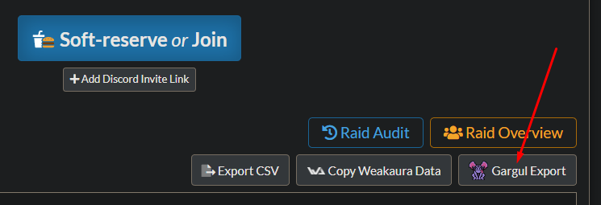
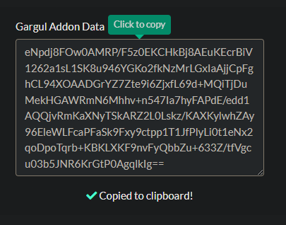

# Roll For
A World of Warcraft Classic (WotLK) addon that automates rolling for items.  
Includes integration with https://softres.it/ using `Gargul Export` feature.

The aim of the addon is simplicity. There is no GUI, because you don't really
need it.  
You think you do, but you don't. :P  
The addon doesn't distribute loot, it only announces rolls.  
It's ulitmately your decision who you'll assign the loot to and how you do it
(trade or master loot).


## Features
 * detects if someone rolls too many times and ignores extra rolls
 * if multiple players roll the same number, it automatically shows it and
   waits for these players to re-roll 
 * integrates with softres.it
 * tries to fix typos or special characters in players' names when importing
   from softres.it
 * supports "two top rolls win" rolling
 * supports raid-rolls
 * it stops rolling and announces the winner if all eligible players rolled
   (that is, all players in the group or players who SRed the item)


## Usage

### Basic item roll
```
/rf <item>
```

Example:  


---

### Basic item roll with custom rolling time
```
/rf <item> <seconds>
```

Example:  


---

### Basic item roll with a message
```
/rf <item> <message...>
```

Example:  


---

### Basic item roll with custom rolling time and a message
```
/rf <item> <seconds> <message...>
```

Example:  


---

### Roll for 2 items (two top rolls win)
```
/rf 2x<item>
```

Example:  


---

### Raid-roll
```
/rr <item>
```

Example:  


---

### Ignore SR and allow everyone to roll
If the item is SRed, the addon will only watch rolls for players who SRed.
However, if you want everyone to roll, even if the item is SRed, use `/arf`
instead of `/rf`. This is useful if you already gave the item to the player who
soft-ressed it and the item dropped again.

"arf" stands for "All Roll For".

---

## Soft-Res setup

1. Create a Soft Res list at https://softres.it/.
2. Once you get some SR items in, click *Gargul Export*.  


3. Copy the data.  


4. Type `/sr` in game.
5. Paste the data into the window.
6. Click *Close*.

The addon will tell you the status of SR import.
If you see `Soft-res setup is complete.` then it means you're good to go.

---

### Fixing mistyped player names in SR setup

The addon is smart enough to fix simple typos for you. It will also deal with
special characters in player names. However, sometimes there's so many typos,
it's not possible and then you have to fix it manually.  

`/sro` (stands for SR Override) is the command to do this.  

Example:  


---

### Showing SRed items
```
/srs
```

---

### Checking SRed items
```
/src
```

---

### Clearing SR data
Do this if you're starting a new raid.
```
/sr init
```

---

## Need more help?

Feel free to hit me up in-game if you need more help.  
Psikutas or Obszczymucha on AU Arugal (Horde).

